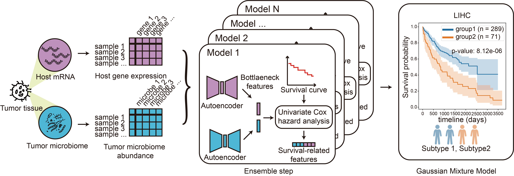

# ASD-cancer
## Introduction
 ASD-cancer (autoencoder-based subtypes detector for cancer) is a semi-supervised deep learning framework based on autoencoder. In our study, autoencoder models were used to extract relevant features from the normalized microbiome abundance data and transcriptome data for identifying cancer survival subtypes. These extracted features were then analyzed using univariate Cox-PH regression to identify a subset of survival-related features. To ensure an adequate number of features, we implemented an ensemble step using a total of 20 models. We then determine the number of survival subtypes using Gaussian Mixture Models and the highest silhouette score. 


## Requirements
The code is written in Python 3.10. The required packages are listed in `requirements.txt`. To install the required packages, run the following command:
```
pip install -r requirements.txt
```
If you wonder gpu acceleration, you can install the gpu version of pytorch according to the [official website](https://pytorch.org/get-started/locally/).

## Command line instructions
To run the script using command line with arguments, use the following format:

```
python main.py -a <micro_dir> \
-r <mRna_dir> \
-s <survival_dir> \
-m <model_dir> \
-o <results_dir> \
[--load-model]
```

The arguments are:

`-a` or `--micro_dir`: A CSV file containing the abundance of microbial communities in the sample. The rows represent the hosts and the columns represent the microbes. The format of the file should look like:
|| microbe1| microbe2|...|
|---|---|---|---|
|host1|0.01|0.05|...|
|host2|0|0.02|...|
|...|...|...|...|

`-r` or `--mRna_dir`: A CSV file containing the expression of fpkm normalized mRNA in the sample. The rows represent the hosts and the columns represent the genes. The format of the file should look like:
|| gene1| gene2|...|
|---|---|---|---|
|host1|20|70|...|
|host2|40|120|...|
|...|...|...|...|

`-s` or `--survival_dir`: A CSV file containing the survival information of the hosts. The file should contains three columns: `sample_id`, `OS` and `OS.time`. `sample_id` is the sample ID of the host, `OS` is the survival status of the host, and `OS.time` is the survival time of the host. The format of the file should look like:
|sample_id| OS| OS.time|
|---|---|---|
|host1|1|150|
|host2|0|200|
|...|...|...|

`-n` or `--num_of_models`: (optional) number of ensemble models. Default is 20.

`-m` or `--model_dir`: directory to save trained models.

`--load-model`: (optional) flag to load trained models.

`-o` or `--results_dir`: directory to save results.

## Example
We provide the data of LIHC as an example dataset in the `data` folder. To run the script using the sample dataset, use the following command:

To train the models and save the results:

```
python main.py -a data/micro.csv \
-r data/mRNA-fpkm.csv \
-s data/survival_meta.csv \
-m models \
-o results
``` 

To load the trained models and save the results:

```
python main.py -a data/micro.csv \
-r data/mRNA-fpkm.csv \
-s data/survival_meta.csv \
-m models \
-o results \
--load-model
```
